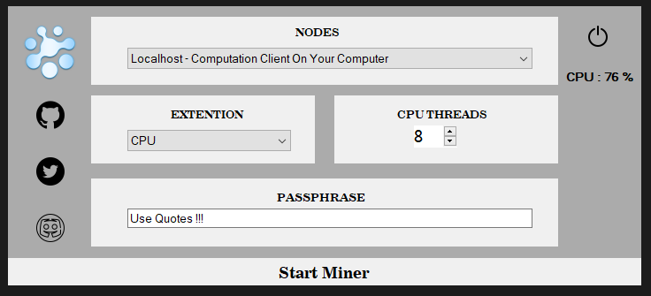

# XEL-GUI-MINER 0.1.0.0 for Windows
* Showing Cpu usage 
* GUI reworked again :)
* Added some comments inside a code 

## XEL-GUI-MINER 0.0.7.1 for Windows

* Added Tooltip
* Opened To Mainnet
* Added Extra Nodes
* Optimized Code

## XEL-GUI-MINER 0.0.7.0 for Windows
### Works only with testnet 
* GUI improvement 
You can download it here https://github.com/tieandsuit/XEL-GUI-MINER/releases

## XEL-GUI-MINER 0.0.5.0 for Windows
### Works only with testnet 

# Please consider supporting .

* BTC : 1KqSZXVETtXnWm7CnT3JkRQyPZ84BhWuy3
* XEL : XEL-MAYC-ZZ3Y-YX56-6NH52
* ETH : 0x4B5448fe30DE26A46C04C660E41d5BD554867F03
* BCH : 18umU3LbhnNEeAH8v53cKr9HheXAhq4oG2
* LTC : LbXzudw7WjxEEG1ckTmjh9mxGhGbs2CPS8
* ETC : 0x2bD235Bd8208287d27581a12d1b7Bbf18b8cA9aD
* DASH : XnhL3W5f6VAUdYBhEC7Zz1LzCqUFCPRHfa
* DOGE : DP9J4NUrw9aRBDJNAAP3VfoCvCcb3HQHaQ
* DGB : DPEM5uxQZNXwbGf5Qf7997aNaAskozB5TC
